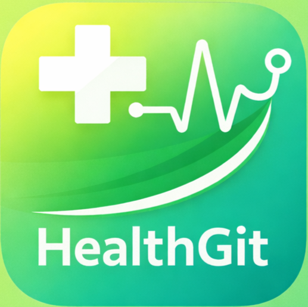
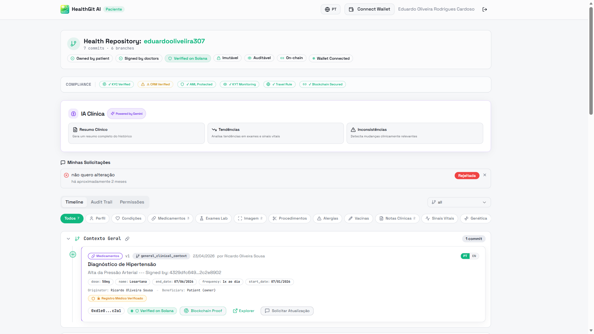

<div align="center">



# HealthGit

### The GitHub for Healthcare

*Transforming fragmented medical data into clinical intelligence using Blockchain + AI.*

<br />


<br />


</div>

<br />

---

## About

> **HealthGit** is a healthcare infrastructure platform that connects fragmented patient records into a secure, intelligent, and interoperable clinical history — powered by **blockchain** and **artificial intelligence**.

The patient owns the repository. Doctors are the contributors.

<br />

---

## Recognition

<div align="center">


<br /><br />

| 🚀 Program | 🎯 Stage | 🧭 Focus |
|:---:|:---:|:---:|
| **Sebrae for Startups** | Pre-acceleration | MVP & Validation |
| **START DIGITAL 2026** | Selected Startup | First Sales |

</div>


> Selected by **Sebrae for Startups** to join the **START DIGITAL** pre-acceleration program — a 6-month journey focused on MVP, validation, and first sales.

<br />

---

## The Problem

Healthcare systems still operate with **fragmented records** distributed across hospitals, clinics, and laboratories.

```
🏥  Hospital A  ──┐
🏥  Hospital B  ──┤      ❌  Disconnected
🧪  Lab C       ──┤      ❌  Duplicated
👨‍⚕️  Clinic D    ──┘      ❌  Incomplete
```

**This leads to:**

- ◦ Incomplete clinical decisions
- ◦ Duplicated and unnecessary exams
- ◦ Inefficient treatments
- ◦ Lack of interoperability between systems

<br />

---

## How It Works

<div align="center">

**`Medical Records`** → **`Blockchain Verification`** → **`AI Analysis`** → **`Clinical Intelligence`**

</div>

<br />

HealthGit creates an **immutable and interoperable medical history** where patients control permissions and healthcare professionals access trusted data in real time.

<br />

---

## Why Solana

<table>
<tr>
<td width="33%" align="center">

### ⚡
**Fast Confirmation**

Sub-second finality for real-time clinical access.

</td>
<td width="33%" align="center">

### 💸
**Low Cost**

Affordable transactions at healthcare scale.

</td>
<td width="33%" align="center">

### 🌐
**Scalability**

Built for millions of patient records.

</td>
</tr>
<tr>
<td align="center">

### 🔒
**Secure Infrastructure**

Cryptographic integrity by design.

</td>
<td align="center">

### 🌎
**Global Reach**

Borderless healthcare interoperability.

</td>
<td align="center">

### 🧬
**Health-Native**

Tuned for sensitive clinical data flows.

</td>
</tr>
</table>

<br />

---

## Visual Showcase

<div align="center">


*Seja Dono do Seu Histórico Médico — Versionado. Imutável. Inteligente.*

<br /><br />



*Health Repository — Compliance, IA Clínica & Timeline on-chain*

</div>

<br />

---

## Technologies

<div align="center">


</div>

<br />

---

## Purpose

<div align="center">

> ### *Building the infrastructure for secure, interoperable, and intelligent healthcare systems.*

</div>

<br />

---

## Contact

<div align="center">

[](https://github.com/)
[](https://linkedin.com/)
[](#)

<br />

<sub>© 2026 HealthGit — Versioned. Immutable. Intelligent.</sub>

</div>
